# Hiair mobile app & API Server

## Environment

### Flutter

- 2.10.4

### GoLang

- 1.17.4

### IDE

- [Visual Studio Code](https://code.visualstudio.com/)

    <details>
    <summary>Extensions</summary>

  - [Dart](https://marketplace.visualstudio.com/items?itemName=Dart-Code.dart-code)
  - [Flutter](https://marketplace.visualstudio.com/items?itemName=Dart-Code.flutter)
  - [Flutter Color](https://marketplace.visualstudio.com/items?itemName=circlecodesolution.ccs-flutter-color)
  - [Version Lens](https://marketplace.visualstudio.com/items?itemName=pflannery.vscode-versionlens)
  - [indent-rainbow](https://marketplace.visualstudio.com/items?itemName=oderwat.indent-rainbow)
  - [Go](https://marketplace.visualstudio.com/items?itemName=golang.Go)
  - [Go Nightly](https://marketplace.visualstudio.com/items?itemName=golang.go-nightly)
  - [REST Client](https://marketplace.visualstudio.com/items?itemName=humao.rest-client)
  - [Todo Tree](https://marketplace.visualstudio.com/items?itemName=Gruntfuggly.todo-tree)
  - [Git History](https://marketplace.visualstudio.com/items?itemName=donjayamanne.githistory)
  - [Error Lens](https://marketplace.visualstudio.com/items?itemName=usernamehw.errorlens)
  - [Better Comments](https://marketplace.visualstudio.com/items?itemName=aaron-bond.better-comments)

    </details>

---

## 환경 설정

### 1.Flutter

- flutter 2.10.4 clone

```bash
git clone -b 2.10.4 https://github.com/flutter/flutter.git
```

- 환경 변수 설정
  - flutter/bin 까지 시스템 변수로 선언  
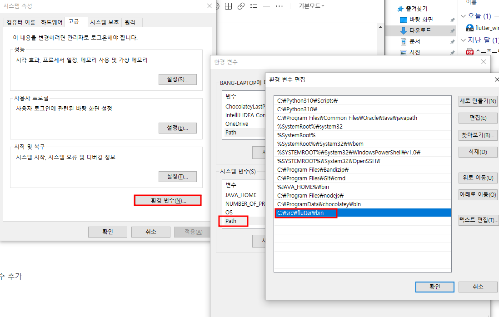  

- flutter command로 체크  

```bash
# 버전 정보 및 flutter path 잘 잡혔는지 확인
```

```bash
flutter --version
```

```bash
# 어떤 문제 있는지 확인
```

```bash
flutter doctor
```

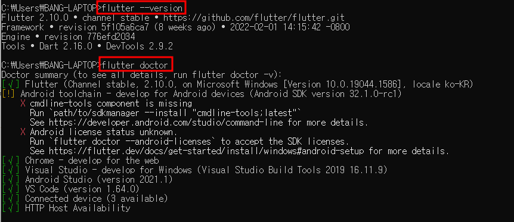  

- [Visual Studio Code](https://code.visualstudio.com/), [Android Studio](https://developer.android.com/studio?gclid=Cj0KCQjwkt6aBhDKARIsAAyeLJ2cXn3itdJ2ihf2zUEudEyTuomA7v3pPK5Xk6pETnrZn4s-wo1ojtkaAsxLEALw_wcB&gclsrc=aw.ds) 설치

- Android Studio 실행 후 cmdline-tools 설치

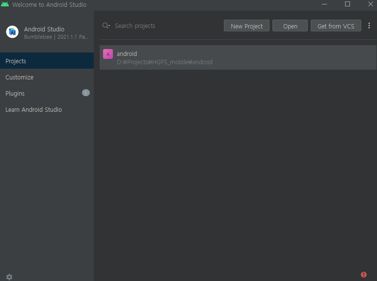  
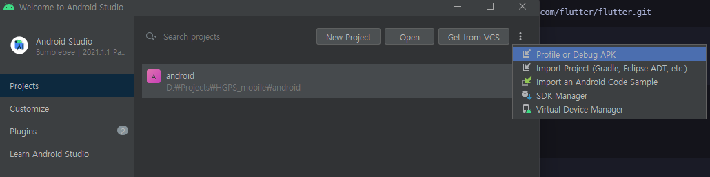  
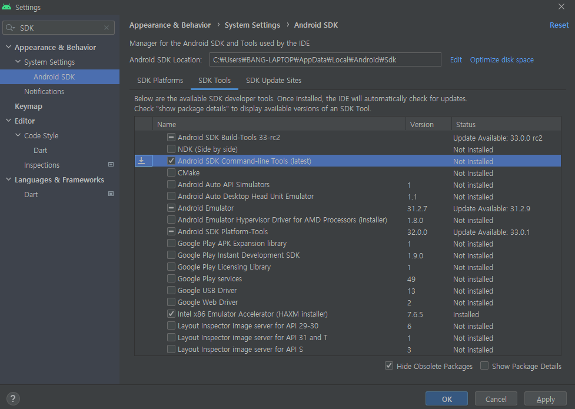  

- 라이센스 정보 받아오기

```bash
flutter doctor --android-licenses
```

- 설치에 문제가 없는지 확인하기
  - Visual Studio 관련 문제를 보인다면 무시해도 됨
  - Visual Studio는 Widows Desktop Application으로 실행해보고 싶을 때 설정

```bash
flutter doctor
```

### 2. Go

- [Go 1.17.4](https://go.dev/dl/go1.17.4.windows-amd64.msi) 설치

- 설치에 문제가 없는지 확인

```bash
go version
```

---

## VS Code에서 프로젝트 실행하는 방법

1. Flutter

    - /frontend 열기
    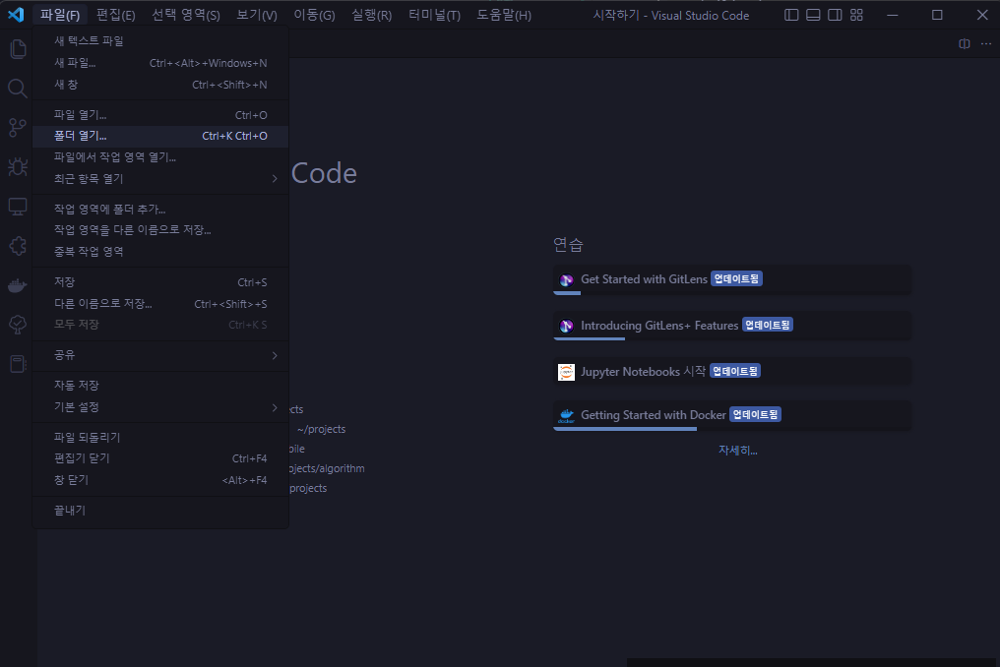
    - 장치 선택
      - 우측 하단 확인
    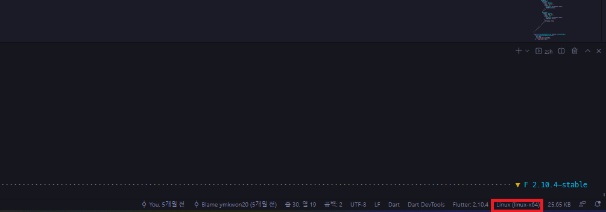
      - 상단 중앙 확인하여 원하는 기기 선택
    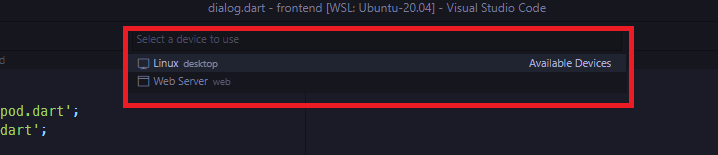
    - run(F5)
      - .vscode/launch.json이 없을 경우 생성 후 다음 삽입

      ```json
      {
        "version": "0.2.0",
        "configurations": [
            {
                "name": "frontend",
                "request": "launch",
                "type": "dart"
            },
            {
                "name": "frontend (profile mode)",
                "request": "launch",
                "type": "dart",
                "flutterMode": "profile"
            },
            {
                "name": "frontend (release mode)",
                "request": "launch",
                "type": "dart",
                "flutterMode": "release"
            }
        ]
      }
      ```

2. Go

    - /backend 열기
    - 터미널 실행
      - Ctrl+Shift+P -> Terminal:Crete New Terminal  
    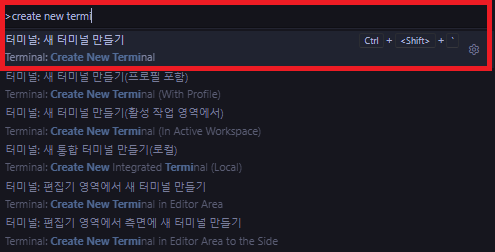
    - 터미널에 다음 커맨드 수행

    ```bash
    go run main.go
    ```

---

## 주의 사항

1. Flutter

    - 추가 등

2. Go

    - "cannot read from a config" 에러가 뜨는 경우

    ```bash
    2022/10/26 12:25:34 cannot read from a config
    exit status 1
    ```

      - backend/core/config.yml 파일이 없기 때문에 문제가 생김
        - 넣지 않은 이유
          - DB 연결 정보와 관련된 내용이기 때문
          - DB 연결 정보만 비우고 파일을 넣어놓으면, run이 되기 때문에 초기 설정에 DB 연결정보에 대한 주의를 기울이지 않기 때문
      - backend/core/config.yml 파일을 생성하고 다음 형태로 적용

      ```yml
      database:
        address: 
        port: 0000
        schema: here-is-schema
        user: here-is-username
        pwd: "here-is-password"

      server:
        port: 9090

      image-path: image-path
      apk-path: apk-path
      ```

---

## Basic Command

1. Flutter

    - 모든 커맨드는 pubspec.yaml가 있는 폴더에서 적용해야 함

    - flutter 의존성 초기화하기
      - 의존성을 처음부터 다시 가져와야 될 경우 사용할 수 있음

    ```bash
    flutter clean
    ```

    - pubspec.yaml 사항 반영하기
      - vscode에서 pubspec.yaml 파일을 저장했을 때 자동으로 커맨드를 수행하게 되지만, flutter clean을 했을 경우 수동으로 사용할 수 있음

    ```bash
    flutter pub get
    ```

    - apk 빌드하기
      - 다른 빌드 파일을 만드는 방법은 [공식문서](https://docs.flutter.dev/)를 참조

    ```bash
    flutter build apk
    ```

    - code 생성하기 (freezed, flutter_gen)
      - data class나, asset 종속성을 code generation을 통해서 자동으로 생성하게 할 수 있음

    ```bash
    # 한번만 생성하기
    ```

    ```bash
    flutter pub run build_runner build --delete-conflicting-outputs
    ```

    ```bash
    # 이후에 저장할 때마다 변경 사항 반영하기
    ```

    ```bash
    flutter pub run build_runner watch --delete-conflicting-outputs
    ```

    - 프로젝트 실행

    ```bash
    
    # --debug: hot reload(o), performance monitor(o)
    # --profile: hot reload(x), performance monitor(o)
    # --release: hot reload(x), performance monitor(x)
    # --device-id: 연결된 디바이스(web, desktop, mobile) 선택가능
    # 위 커맨드 보다 IDE에서 run(=F5) 하는 방식 추천
    # + hot reload를 저장만 하면 바로 수행 가능
    ```

    ```bash
    flutter run --debug
    ```

    - 버전 확인

    ```bash
    flutter --version
    ```

2. Go

    - 대부분의 커맨드는 backend/ 에서 제대로 적용할 수 있음

    - 프로젝트 실행

    ```bash
    go run main.go
    ```

    - 새 패키지 불러온 후 모듈에 저장

    ```bash
    go mod tidy
    ```

    - 프로젝트 빌드

    ```bash
    go build main.go
    ```

    - 버전 확인

    ```bash
    go version
    ```

---

## 3rd-party dependencies

<details open>
<summary>1.Flutter</summary>

- [dartz](https://pub.dev/packages/dartz): functional programming 문법 지원
- [dio](https://pub.dev/packages/dio): http client
- [flash](https://pub.dev/packages/flash): 다양한 형태의 snackbar 지원
- [flutter_secure_storage](https://pub.dev/packages/flutter_secure_storage): 보안처리된 로컬 저장소
- [freezed, freezed_annotation](https://pub.dev/packages/freezed): data class, union type 지원(code generation 필요)- go_router: page navigation 지원
- [intl](https://pub.dev/packages/intl): DateFormat 및 날짜변환 지원
- [hooks_riverpod](https://pub.dev/packages/hooks_riverpod): state management
- [logging](https://pub.dev/packages/logging): 결과 log 지원
- [package_info_plus](https://pub.dev/packages/package_info_plus): 현재 버전 정보 불러오기로 사용
- [path, path_provider](https://pub.dev/packages/path_provider): 저장 위치 파악하기 위해 경로 지정시 사용
- [shared_preferences](https://pub.dev/packages/shared_preferences): 로컬 저장소 지원
- [url_launcher](https://pub.dev/packages/url_launcher): 외부 url 열기 위해 사용
- [uuid](https://pub.dev/packages/uuid): uuid, guid 등 고유값 생성 지원
- [build_runner](https://pub.dev/packages/build_runner): code generation을 위한 패키지
- [flutter_launcher_icons](https://pub.dev/packages/flutter_launcher_icons): 프로젝트 내부 이미지를 통해 애플리케이션 아이콘 생성(code generation)
- [flutter_gen_runner](https://pub.dev/packages/flutter_gen_runner): 프로젝트에 추가한 이미지, 아이콘 등을 객체로 가져다 쓸 수 있게 만들어주는 패키지(code generation)
- [mocktail](https://pub.dev/packages/mocktail): 테스트용 mock 생성 패키지

</details>

<details open>
<summary>2.Go</summary>

- [go-mssqldb](https://github.com/denisenkom/go-mssqldb): Go를 위한 SQL-Server interface
- [viper](https://github.com/spf13/viper): 파일 접근 라이브러리
- [mux](https://github.com/gorilla/mux): http request router 설정 라이브러리
- [negroni](https://github.com/urfave/negroni): web 미들웨어

</details>

---

## Directory structure

- 수정하는데 사용되지 않는 것은 생략 설명

<details open>
<summary>1.Flutter</summary>

```text
frotend
├─ assets: 이미지,아이콘,폰트,음악 파일 등 프로젝트에 사용되는 자원 저장
├─ lib
│  ├─ src
│  │  ├─ core: 다른 소스코드에서 사용되는 공통 항목 정의
│  │  ├─ app.dart: 보여질 앱 화면 정보 정리 
│  │  └─ ...features: 밑에서 자세히 설명
│  └─ main.dart: 진입 지점(entry point)
├─ test: 테스트 코드
├─ pubspec.yaml: 프로젝트 정보 및 의존성 정의하는 곳
├─ analysis_options.yaml: 코드 맞춤법 정의
└─ .gitignore: git이 무시할 파일 정의
```

- features 보기

```text
feature
├─ application: application 로직이 포함된 곳
├─ domain: domain 로직이 포함된 곳, 현재는 엔티티(Data Structure)만 존재함
├─ infrastructure: 원격 DB, 로컬 DB 등의 로직이 포함된 곳
├─ presentation: 화면에 보여지는 것들이 포함된 곳
└─ dependency_injection.dart: 전체 feature에서 빠져있는 의존성을 한꺼번에 주입하는 곳
```

</details>

<details open>
<summary>2.Go</summary>

```text
backend
├─ core: 공통으로 사용되는 부분 정의
├─ handler
│  ├─ apk.go: apk 다운로드/정보 조회 관련 코드
│  ├─ handler.go: url routing 관련 코드
│  └─ upload.go: 파일 업로드 관련 코드
├─ infrastructure: DB 관련 로직 포함
├─ go.mod: 패키지 정보 포함
└─ main.go: 진입 지점(엔트리 포인트)
```

</details>

---

## CI/CD(Continuous Integration/Continuous Delivery) Tools

- CI(Continous Integration)
  - GitHub
    - **main 브랜치에 push 하게 되면 바로 운영에 반영되니 주의**
    - backend를 반영하고 싶다면 push 만 하면 됨
    - **frontend는 해당 커밋에 tag를 붙이고 반영하면 CD에서 새로 빌드해서 배포**

- CD(Continuous Delivery)
  - Jenkins
    - GitHub에 commit이 push 되면 GitHub Webhook이 연결되어 있는 서비스로 메시지 보내줌
    - 방화벽이 적용된 연결이므로 [ngrok](https://ngrok.com/)이라는 서비스를 이용하여 포트포워딩 해주어야 함
      - 무료 서비스를 사용하는 중이므로 ngrok 종료 후 재실행시 port-forwarding url이 계속 변경됨
      - 피치 못하게 nrok을 종료했다면 github에서 ngrok port-forwarding url을 업데이트 해줘야 함
      - 방법
      1. 바탕화면에 ngrok.bat 파일 실행  
      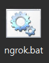
      2. command line에 나타난 forwarding url 복사  
      ex) <https://this-is-an-example-url.jp.ngrok.io>  
      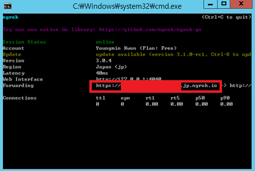
      3. github repository -> settings -> webhooks -> edit 이동  
      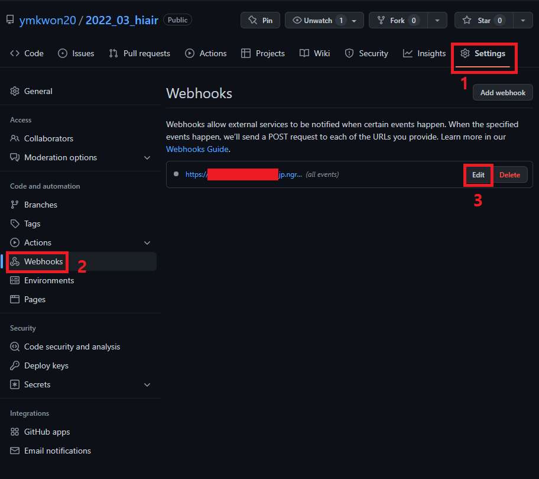
      4. webhook url 업데이트(반드시 뒤에 /github-webhook/ 적어줘야함)
      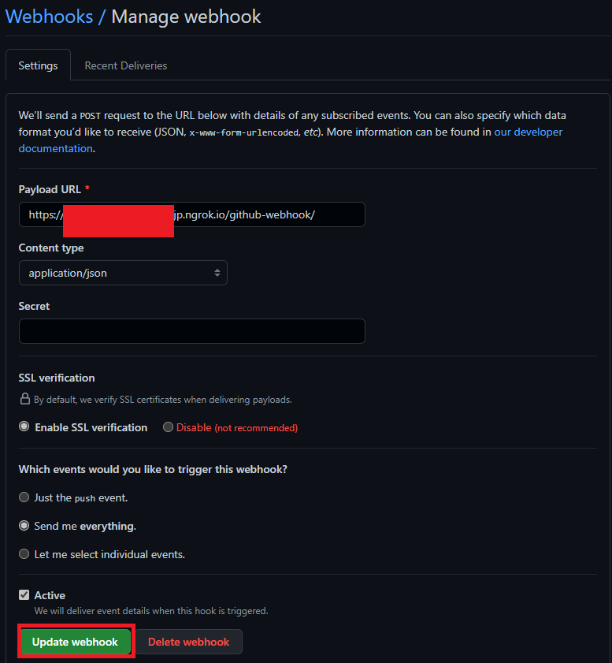

---

## 핵심 개발 용어

### Either<Left,Right>

- 함수형 프로그래밍에서 지원하는 데이터 타입 중 하나
- "either left or right" 처럼 left 혹은 right 중 하나의 타입을 가지게 된다는 의미
- if 문을 적지 않고 오류 처리가 가능하게 됨
- fold(whenLeft,whenRight) 를 통해 오류 케이스의 가독성이 좋아짐
- 관례적으로 Left는 실패, Right는 성공을 나타냄

### Repository

- Repository Pattern
- 데이터 출처(local db인지 api 응답인지)와 관계 없이 동일한 인터페이스로 데이터에 접근할 수 있도록 만드는 패턴
- 데이터 로직과 비즈니스 로직을 분리하는 역할

### DTO

- Data Transfer Object
- Data Structure의 한 종류
- 저장소로부터 전달된 데이터를 Domain 객체로 전환해주는 역할을 가지고 있는 객체
- 계층간 데이터 교환을 위해 사용하는 객체

### Datasource

- repository에 제공하는 데이터 접근을 관장하는 객체
- repository 인터페이스의 구현에 의존성 주입하여 사용함
- 데이터 출처에 따라 local 인지 remote 인지로 구분함

---

## 수정 시나리오 예시

1. 로그인 화면 수정

- 요구사항
  - 현재는 ID만 입력해서 로그인 하고 있으나, 누구나 접근이 가능해지니 Password도 받아서 로그인 하도록 변경
- 생각 프로세스

```text
1. 화면은 변경되는가? -> O
  : 아이디 밑에 비밀번호 입력칸 넣기

2. 애플리케이션 로직이 변경되는가? -> O
  : 기존 아이디 + 새로운 비밀번호를 비즈니스 로직으로 넘겨줘야 함

3. 비즈니스 로직이 변경되는가? -> O
  : 아이디 비밀번호 검증을 위해 외부에 확인을 요청해야함

4. 외부 DB와의 약속이 변경되는가? -> O
  : 아이디 + 비밀번호를 넘겨야 함

5. 백앤드 변경되는가? -> O
  : 백앤드에서 로그인 로직을 처리하건, PM의 요청에 의해 DB에서 처리하건 유효한 아이디인지 검증해야함
```

- 적용
  1) 프론트-프리젠테이션 계층 수정
      - frontend/lib/src/auth/presentation/sign_in_form_widget.dart 열기
      - password 를 입력할 widget 및 controller 생성

      ```dart
      +++
      late TextEditiingController _pwController;
      ...

      @override
      void initState() {
        super.initState();
        ...
        +++
        _pwController = TextEditingController();
        ...
      }

      @override
      void dispose() {
        _pwController.dispose();
      }
      
      ...

      Widget _buildPasswordFormField(...) {
        return TextFormField(
          ...,
          controller: _pwController,
        );
      }
      ```

      - password widget 주입(line 94)

      ```dart
      ...
      _buildIdFormField(context),
      +++
      _buildPasswordFormField(...),
      ...
      ```

      - password을 application layer로 넘기기(line 52)

      ```dart
      void _onPressed() {
        ...
        if (formKey.currentState!.validate()) {
          final params = {
            "id": _idController.text,
            +++
            "password": _pwController.text,
          }
        }
      }

      ```

  2) 프론트-애플리케이션 계층 수정
      - 소스코드 확인하니 Map으로 값을 받기 때문에 수정하지 않아도 됨
      - 구조적 엄밀성, 더 높은 가독성을 원한다면 새로운 형태의 User- 생성하는 것 고려

  3) 프론트-도메인 계층 수정
      - 상기 이유와 같은 이유로 수정할 것이 없음
      - 상기 사항 고려 하기

  4) 프론트-인프라 계층 수정
      - 상기 이유와 같은 이유로 수정할 것이 없음
      - 상기 사항 고려 하기
      - auth_remote_dio_service.dart 의 end-point 가 /sign-in 인 것 확인하기

  5) 백-handler 수정
      - /backend/handler.go의 signIn 메소드 확인
      - 생각 프로세스 5번에서 언급한대로, 기호에 맞춰서 처리해줌
      - query 에 password 파라미터 추가하기

      ```go

      func (a *AppHandler) signIn(w http.ResponseWriter, r *http.Request) {
        var params map[string]interface{}

        ...

        query := fmt.Sprintf(`
        EXEC SP_TABLET_LOG_01_SELECT '%s';
        `, params["id"], params["pw"])
      }

      ```

2. 마지막 버전 배포된 날짜 확인하기 기능 추가

- 생각 프로세스

```text
1. 화면은 변경되는가? -> O
  : 배포 날짜를 확인하는 화면이 필요하다면 추가 되야함

2. 애플리케이션 로직이 변경되는가? -> O
  : 추가 되야함

3. 비즈니스 로직이 변경되는가? -> O
  : 추가 되야함

4. 외부 DB와의 약속이 변경되는가? -> O
  : 추가 되야함

5. 백앤드 변경되는가? -> O
  : 추가 되야함
```

- 적용

  1) 프론트: 도메인 계층 추가
      - 어떠한 entity로 받아서 처리할 것인지 결정
        - 객체로 만들 이유를 찾지 못했다면 String으로 생성해도 무방함
      - usecase 생성
        - frontend/lib/src/version/domain/usecases/fetch_last_date_of_release.dart 생성

        ```dart
        class FetchLastDateOfRelease implements Usecase<String,void> {
          const FetchLastDateOfRelease({required IVersionRepository repository})
          :_repository=repository;

          @override
          Future<Either<Failure,String>> call([void params]) async {
            return _repository.fetchLastDateOfRelease();
          }

        }

        ```

      - repository method 추가
        - frontend/lib/src/version/domain/repositories/i_version_repository.dart

        ```dart
        +++
        Future<String> fetchLastDateOfRelease();
        ```

  2) 프론트: 인프라 계층 추가
      - repository 구현 수정
        - frontend/lib/src/version/infrastructure/repositories/version_repository.dart

        ```dart
        +++
        @override
        Future<String> fetchLastDateOfRelease() async {
          ...
        }
        ```

      - datasource 추가
        - frontend/lib/src/version/infrastructure/datasources/version_remote_service.dart

        ```dart
        +++
        Future<String> fetchLastDateOfRelease();
        ```

      - datasource 구현 수정
        - frontend/lib/src/version/infrastructure/datasources/version_dio_remote_service.dart

        ```dart
        ...
        +++
        @override
        Future<String> fetchLastDateOfRelease() async {
          ...
        }
        ```

  3) 프론트: 애플리케이션 계층 추가

      - 상태로 표현하고 싶은 경우
        - ..._state.dart, ..._event.dart 형태를 참고하여 생성
      - 상태로 표현하고 싶지 않은 경우
        - frontend/lib/src/version/application/version_date_state_notifier.dart 생성 후 다음과 같은 패턴으로 코드 작성

        ```dart
        class VersionDateStateNotifier extends StateNotifier<String> {
          
          final FetchLastDateOfRelease _fetchLastDate;

          VersionDateStateNotifier({
            required FetchLastDateOfRelease fetchLastDate,
          }):_fetchLastDate=fetchLastDate, super("");

          Future<void> nameThisFunction() async {
            final resultsOrFailure = await _fetchLastDate();
            resultsOrFailure.fold(
              (l) {},
              (r) => state = r,
            );
          }
        }
        ```

  4) 프론트: 의존성 주입

      - 각각 계층의 클래스에 포함된 의존성을 주입
      - frontend/lib/src/version/dependency_injection.dart

      ```dart
      +++
      final versionDateStateNotifierProvider = StateNotifierProvider<VersionDateStateNotifier,String>(
        (ref)=>VersionDateStateNotifier(
          fetchLastDate:ref.watch(fetchLastDateProvider),
        ),
      );

      final fetchLastDateProvider = Provider(
        (ref)=>FetchLastDateOfRelease(
          repository: ref.watch(versionRepositoryProvider),
        ),
      );
      ```

  5) 프론트: 프리젠테이션 계층 추가
     - 화면이 필요한 경우 추가
     - ex) frontend/lib/src/version/presentation/version_date_widget.dart
  
  6) 백: API 추가
      - backend/handler/handler.go

      ```go
      +++
      r.HandleFunc("/apk/date", a.fetchLastDateOfRelease).Methods("GET")

      ...
      func (a *AppHandler) fetchLastDateOfRelease() {
        ...
      }
      ```
